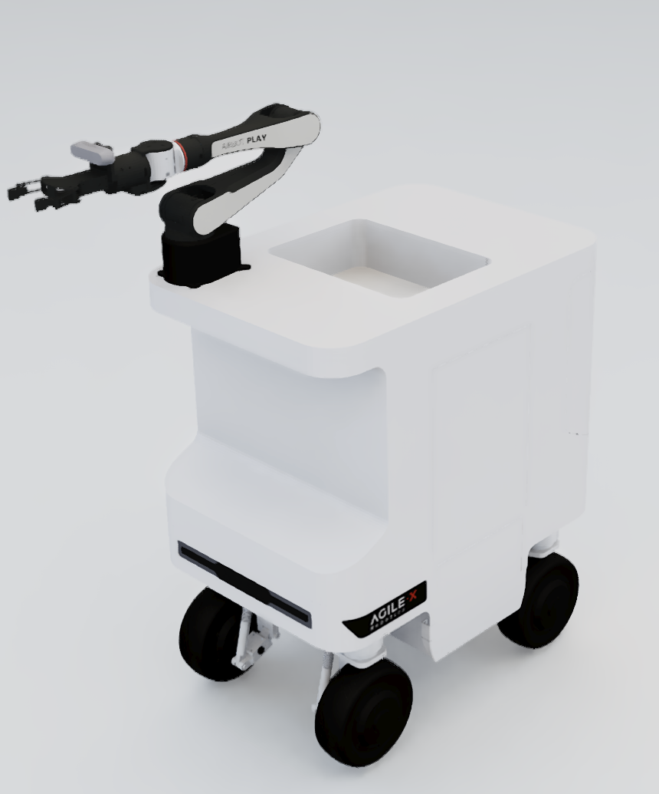
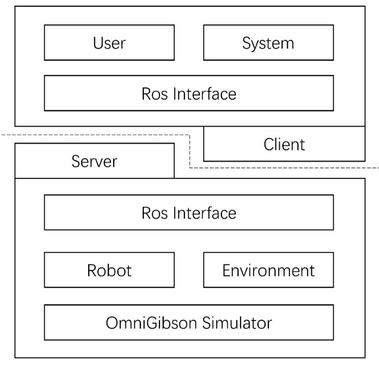

# ICRA AgileX Sim2Real Challenge

## Hardware 
The robotic system, AIRBOT, is equipped with a moving chassis and is connected to the upper robotic arm by a support structure. 

  

* Horizon Robotics RDK x3:
[RDK x3 User Manual](https://developer.horizon.cc/documents_rdk/)

* Sunny Optical Technology  Mars04D:
[Mars04D User Manual](https://www.sunnyaiot.com/product_detail/Mars04D.html)

* AgileX Robotics RGM2-Ranger mini2.0:
[RGM2-Ranger mini2.0 User Manual](https://github.com/agilexrobotics/AgileX-Robotics-all-products-user-manuals)

## Match related

The AgileX Sim2Real Challenge is a robotics competition based on Isaac Sim's intelligent robot simulation platform. The participating teams need to design algorithms to enable the robot system to independently classify and organize kitchenware (bowls, cups) in the kitchen environment, and correctly summarize different kitchenware into corresponding appliances according to the requirements to obtain points.

This competition will build a customized simulation environment in the **OmniGibson** platform and seamlessly integrate our robots. The robotic system is equipped with a moving chassis and is connected to the upper robotic arm by a support structure. Contestants need to train the algorithm in the simulator to complete different storage subtasks in the 10 minutes of competition time to obtain points.

The organizing committee will then deploy the code in the physical robot in a real scene consistent with the simulation environment, and complete the task through **Sim2Real mode**.

## Simulation platform architecture - Sim

The simulation platform architecture is divided into two parts: Server and Client.

  

The Server is the Docker image of AXS environment configured by the organizing committee. In a simulation environment, Server will provide teams with robot models and competition venues. **The Game Field module includes items such as Site diagram, Tableware, Microwave and Cabinet, etc** The Robot module includes: data interface of the sensor and control interface of the actuator. For detailed interface instructions, **refer to the official Tutorial document**.

Client is a hardware resource that simulates the control of AIRBOT robots, and is here used as a separate packaged Docker image of the competition task. The team can call the interface provided in the Server image to develop the algorithm of the competition task in the Client image. The User module includes the Demo program provided by the organizing committee and the functional modules that the participating teams need to develop. The System module includes the monitoring system, Log system and communication system of the referee system. The System module has a higher process priority than the User module.

Hardware requirements :nvidia GPU 2070+ and 8G+ video memory can better support Simulation environment.

Ubuntu 20.04 or later supports a more convenient experience when needed.

## Core (ROS Master)

This part serves as the communication pivot in ROS systems.

### server

In Phase 1, the task is executed in a simulated scenario. Therefore, we built a real-world test scenario with isaac-sim.

The interface between the server and the client is defined by the ROS topic, which can be found here [ros topic](./Platform_introduction.md).

### Client

In this repo, we provide a baseline method for this task. A functional image can be obtained by building the image or pulling .jieyitsinghuawx/icra2024-sim2real-axs-baseline:v0.0.1

The baseline image (and potentially the images you built) is based on the base image . Basic functional units (e.g. keyboard control) are included in this base image. Please refer to this repo for further information on the base image .jieyitsinghuawx/icra2024-sim2real-axs-baseline:v0.0.1

## Related link

### 1.1 Docker install
* [Installing the system](./sim2real-install-guide.md)

### 1.2 Hardware and topic definition
* [Platform introduction](./Platform_introduction.md)
