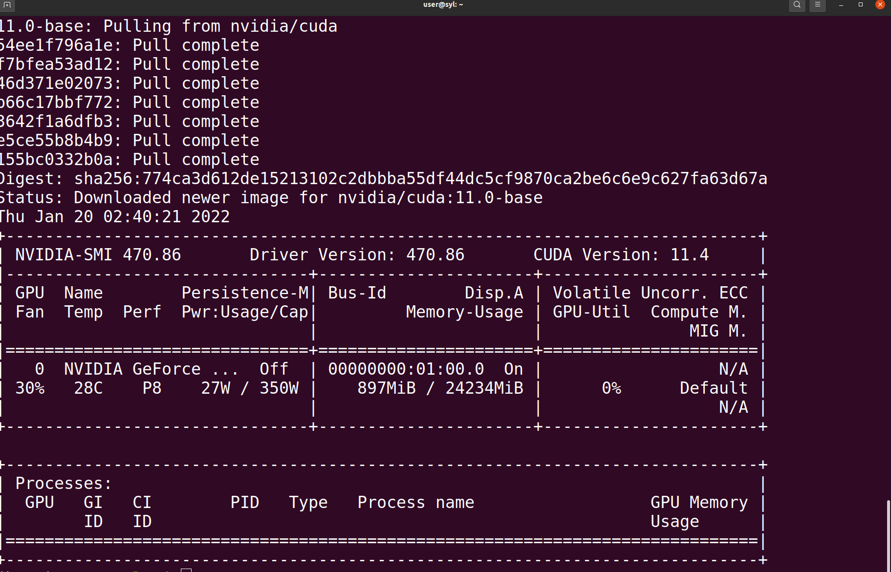
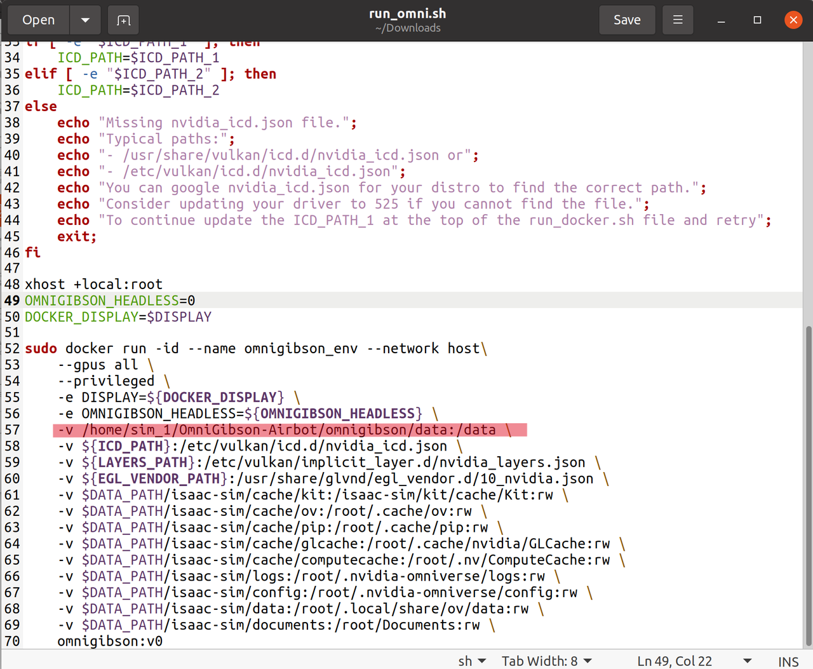

# Installing the system

## Software Architecture - Docker

Docker is an open-source containerization platform that allows developers to package an application and its dependencies into a single container. This container contains everything needed to run the application in any Docker-enabled environment, thus ensuring consistency, portability, and repeatability. 

Docker has a wide range of uses in various application scenarios:

* Application Development and Testing: Developers can use Docker containers to build and test applications in local development environments, ensuring that they work across different environments. This helps solve the "it works on my machine" problem.
* Continuous Integration/Continuous Deployment (CI/CD): Docker containers are integrated with CI/CD tools to automate the building, testing, and deploying of applications, improving the speed and quality of delivery.
* Multi-Cloud and Hybrid Cloud Deployment: Docker containers can run in different cloud providers' environments, enabling multi-cloud and hybrid cloud deployment strategies that provide flexibility and elasticity.
*  Microservice Architecture: Each microservice can be packaged as a separate Docker container, making the microservice architecture easier to manage, scale, and deploy. Container orchestration tools such as Kubernetes can be used to automate the management of microservices.
*  Rapid Scaling and Load Balancing: Docker containers can scale rapidly to meet changing load demands, and container orchestration tools can automate load balancing to ensure high availability and performance.
* Failure Isolation and Security: Each Docker container is isolated and does not interfere with the operations of other containers, helping to improve application security and availability.
* Data Processing and Analytics: Docker containers can be used to package and deploy data processing tasks, accelerating data analytics workloads while providing portability and scalability.

Overall, Docker provides a modernized way to build, deploy, and manage applications, helping to streamline development and operations processes, and improving application reliability and maintainability.
Given these capabilities, Docker has a wide range of uses in various application scenarios and is an important part of containerization technology.

## Host operation

### 1.1 Docker

If docker local installation hasn't been done, switch to the docker_server folder first:

```
cd ./ICRA-RM-Sim2Real/docker_server
```

Execution:

```
./docker_install.sh 
```
 

Evaluation

```
docker --version
```
example:

<div align="center">
  
</div>


Reference for docker installation on Ubuntu:

* [docker install](https://docs.docker.com/engine/install/ubuntu/)

**If the shell script cannot be run, check if there is permission for the script. Otherwise change the mode with chmod**


## 1.2 Nvidia driver

Check the version of host GPU driver before creating the docker and container, carefully keeping the same with the version inside docker. Currently the NVIDIA driver version inside the docker repos is 470.86.

In Ubuntu, ```Software & Updates > Additional Drivers``` is recommanded to update the Nvidia driver.

Open the terminal, input nvidia-smi and press enter to get the driver version:

<div align="center">
  
</div>


Know issue: If your OS is Ubuntu21.04 or later, please refer [issue](https://codeantenna.com/a/nRJ1FuHehu) to fix

## 1.3 Install the nvidia-docker2

### 1.3.1 Main stages for docker installation reference

```
sudo systemctl --now enable docker

distribution=$(. /etc/os-release;echo $ID$VERSION_ID) \
   && curl -s -L https://nvidia.github.io/nvidia-docker/gpgkey | sudo apt-key add - \
   && curl -s -L https://nvidia.github.io/nvidia-docker/$distribution/nvidia-docker.list | sudo tee /etc/apt/sources.list.d/nvidia-docker.list

sudo apt-get update
sudo apt-get install -y nvidia-docker2
sudo systemctl restart docker

# test
sudo docker run --rm --gpus all nvidia/cuda:11.0-base nvidia-smi
```
<div align="center">
  
</div>


Reference link for docker installation: [docker](https://docs.nvidia.com/datacenter/cloud-native/container-toolkit/latest/install-guide.html)


## 1.4 docker login

Register the dockerhub account:

* [dockerhub](https://hub.docker.com/)

And get access token for late use:

* https://docs.docker.com/docker-hub/access-tokens/

     
login the docker account:

```
sudo docker login
```
<div align="center">
  
</div>


## 1.5 Docker Install

### 1. Download the files required to configure the Docker image from the following address:

```angular2html
link：https://pan.baidu.com/s/1aPxHzKSQPSr-oyiPOXT95w 
Extract code：8b32
```
### 2. Requirements for the Linux environment：
Make sure that Docker is installed on the Linux system and that the GPU can be run in Docker. 
* You can install Docker in the following ways：
```angular2html
Open the downloaded folder omnigibson_docker and locate the docker_install.sh file。
Open Terminal or Command Prompt and go to the directory containing the image file.
Run command:sudo chmod 755 ./docker_install.sh
Run command：./docker_install.sh
```
* The following ways can be used to make it possible to run GPUs in Docker:
```angular2html
Follow the tutorial at the URL below to install the NVIDIA Container Toolkit：
https://docs.nvidia.com/datacenter/cloud-native/container-toolkit/latest/install-guide.html
```
### 3. Load the Docker image to the machine：
1. Locate the downloaded Docker image.
2. Open Terminal or Command Prompt and go to the directory containing the image file.
3. Run the import command. Run the following command to import the image into the Docker environment:
```angular2html
docker load -i v1.tar
```
4. After this command is executed, Docker will import the image in the v1 .tar file into the local Docker environment. You can run the following command to view the list of imported images and confirm that the v1 images have been imported:
```angular2html
docker images
```

### 4. Mount the Data folder
  1. Locate the downloaded run_omni.sh file
  2. Open and make changes to what's highlighted in red below, then save and exit
  <div align="center">
    
  </div>

```angular2html
//modify -v /home/sim_1/OmniGibson-Airbot/omnigibson/data:/data 
//Modify the directory /home/sim_1/OmniGibson-Airbot/omnigibson/data in the previous section to the directory of the data file in the real machine
```
```
#Open a terminal or command prompt and go to the directory containing the run_omni.sh and run:
sudo chmod 755 ./run_omni.sh
./run_omni.sh
```
### 5. Entering a Docker Image (You can use the following methods)
  1. Open the downloaded folder omnigibson_docker and find the exec.sh file.
  2. Open Terminal or Command Prompt and go to the directory containing the image file.
  3. Run command:
```angular2html
sudo chmod 755 ./exec.sh
./exec.sh
```
6. Check whether the Data folder is successfully attached


## Docker Server operation

### 2.1 To start the docker

Run this line again after reset

```
sudo docker start sim2real_server 

cd ./ICRA-RM-Sim2Real/docker_server

./exec_server.sh
```
Enter the docker

### 2.2 Start the OmniGibson sim

Start a new terminal.

```
cd ./ICRA-RM-Sim2Real/docker_server

./exec_server.sh

roscore

```
Create a new terminal

```
cd ~/OmniGibson_Airbot/

python -m omnigibson.AXS_env --ik

```

There should be a window created and scene showed in the window, use `W`, `A`, `S`, `D` to control agent move.


### 2.3 Start the MoveIt!

Run the following command to start the MoveIt! service:

```
roslaunch airbot_play_launch airbot_play_moveit.launch use_rviz:=true target_moveit_config:=airbot_play_v2_1_config use_basic:=true
```

**client**
 
 
Start TF release
Create two new terminals

```
# source moveit ik workspace
roslaunch airbot_play_launch robot_state_publisher.launch robot_description_path:=gibson的urdf路径
roslaunch airbot_play_launch static_transform_publisher.launch

```
Start hdl_localization

Create two new terminals
```
source ~/Workspace/hdl_ws/devel/setup.bash
roslaunch hdl_localization hdl_localization.launch
```

Start baseline
```
conda activate baseline
cd ~/Workspace/AXS_baseline/ICRA2024-Sim2Real-AXS
python src/airbot/example/segmentor.py
```
